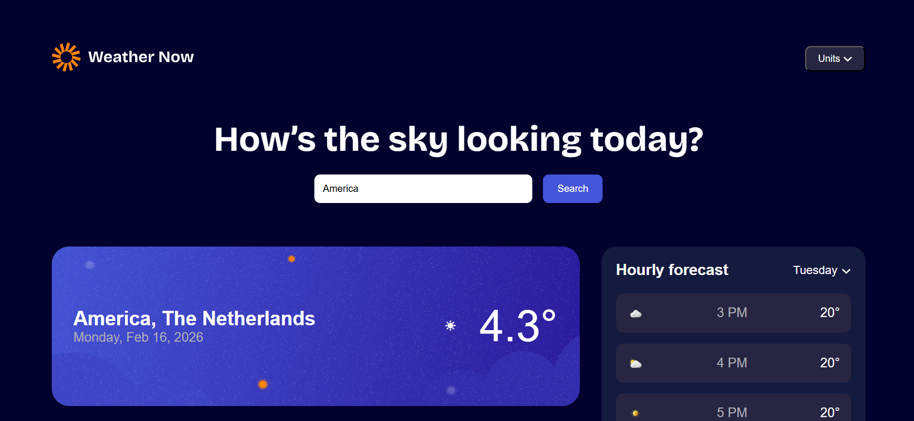
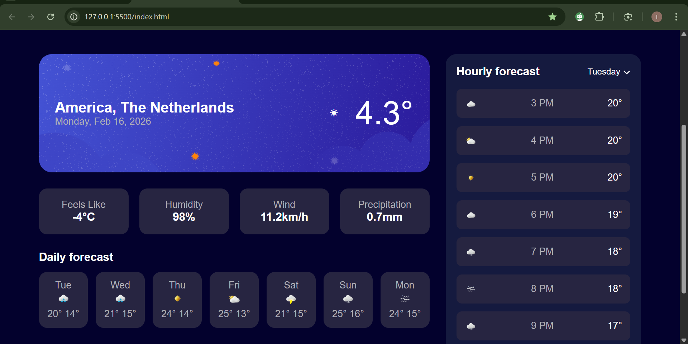

# Frontend Mentor - Weather App Solution
This is my solution to the [Weather App challenge on Frontend Mentor](https://www.frontendmentor.io/challenges/weather-app-K1FhddVm49). This project helped me strengthen my skills in working with APIs, DOM manipulation, responsive layouts, and dynamic UI updates using vanilla JavaScript.

---

## Overview

### The challenge

Users should be able to:

* Search for weather information by entering a location
* View current weather conditions (temperature and location details)
* See additional weather metrics:

  * Feels like temperature
  * Humidity
  * Wind speed
  * Precipitation
* Browse a 7-day weather forecast
* View an hourly forecast section
* Toggle between measurement units (Metric and Imperial)
* View responsive layout across devices
* See hover and focus states for interactive elements

---

### Screenshot




### Links

* Solution URL: (https://github.com/Isabella172/weather-app.git)

---

## My Process

### Built with

* Semantic HTML5 markup
* CSS custom properties (CSS variables)
* Flexbox
* CSS Grid
* Responsive design with media queries
* Vanilla JavaScript (ES6+)
* Async/Await for API handling
* Open-Meteo Geocoding API
* Open-Meteo Weather Forecast API

---

## Features Implemented

### ✅ City Search

Users can search for a city using the search bar.
The app:

1. Uses the **Open-Meteo Geocoding API** to get latitude and longitude.
2. Uses the coordinates to fetch weather data from the **Open-Meteo Forecast API**.
3. Dynamically updates the UI.

---

### ✅ Current Weather Display

The app dynamically displays:

* Current temperature
* City and country
* Current date (generated automatically)
* Wind speed
* Feels like temperature
* Humidity
* Precipitation

Example of dynamic update logic:

```js
document.getElementById("temp").textContent =
  weatherData.current_weather.temperature + "°C";
```

---

### ✅ 7-Day Forecast (Dynamic)

The daily forecast section was converted from static HTML into dynamic cards generated with JavaScript.

* Data pulled from:

  * `temperature_2m_max`
  * `temperature_2m_min`
* Cards are generated using `createElement`
* Old forecast is cleared before inserting new results

Example:

```js
const card = document.createElement("div");
card.classList.add("day-card");

card.innerHTML = `
  <p>${dayName}</p>
  <p>${Math.round(maxTemps[i])}° ${Math.round(minTemps[i])}°</p>
`;

dailyContainer.appendChild(card);
```

This ensures the forecast updates whenever a new city is searched.

---

### 🚧 Hourly Forecast

The hourly forecast layout is implemented and styled.

The structure is ready for dynamic integration using the hourly API data.
This will allow switching between days and updating hourly temperatures dynamically.

---

### 🚧 Units Toggle (In Progress)

The UI for unit selection is implemented.

Next step:

* Fully connect the toggle to convert:

  * °C ↔ °F
  * km/h ↔ mph
  * mm ↔ inches

---

### ✅ Responsive Design

The layout adapts using CSS Grid and media queries.

On mobile:

* The main content switches to a single-column layout
* Daily forecast becomes horizontally scrollable

```css
@media (max-width: 768px) {
  .main-content {
    grid-template-columns: 1fr;
  }
}
```

---

## What I Learned

### 1️⃣ Working with Multiple APIs

I learned how to chain API calls:

* First API → get coordinates
* Second API → fetch weather data

This improved my understanding of asynchronous JavaScript and real-world data flow.

---

### 2️⃣ DOM Manipulation

Instead of hardcoding forecast cards, I learned to:

* Clear containers
* Create elements dynamically
* Insert content programmatically

This made the UI fully dynamic.

---

### 3️⃣ Debugging with Console

Using:

```js
console.log(weatherData);
```

helped me inspect API responses and correctly extract nested data like:

```js
weatherData.hourly.apparent_temperature[0]
```

---

### 4️⃣ CSS Structure & Layout

I strengthened my understanding of:

* CSS variables
* Grid layouts
* Component-style structuring
* Maintaining consistent spacing and alignment

---

## Continued Development

In future iterations, I plan to:

* Fully implement dynamic hourly forecast
* Complete unit toggle functionality
* Add dynamic weather icons based on weather codes
* Improve UI states (loading, error handling)
* Store selected unit in localStorage
* Add smoother UI transitions

---

## Useful Resources

* [Open-Meteo API Documentation](https://open-meteo.com/)
* MDN Web Docs – Async/Await
* Frontend Mentor Community Solutions

---

## AI Collaboration

I used ChatGPT to:

* Debug API integration issues
* Refactor JavaScript logic
* Improve overall project structure

AI helped me:

* Understand how to structure API calls properly
* Improve my DOM manipulation techniques
* Identify logic mistakes (like overwriting temperature values)

This improved both my coding speed and understanding.

---

## Author

* Name: Asantewaa Isabella
* Frontend Mentee
* GitHub: (https://github.com/Isabella172)

---

## Acknowledgments

Thanks to Audrey Zunuoh for providing a realistic challenge that helped me improve my frontend development skills and API integration knowledge.

